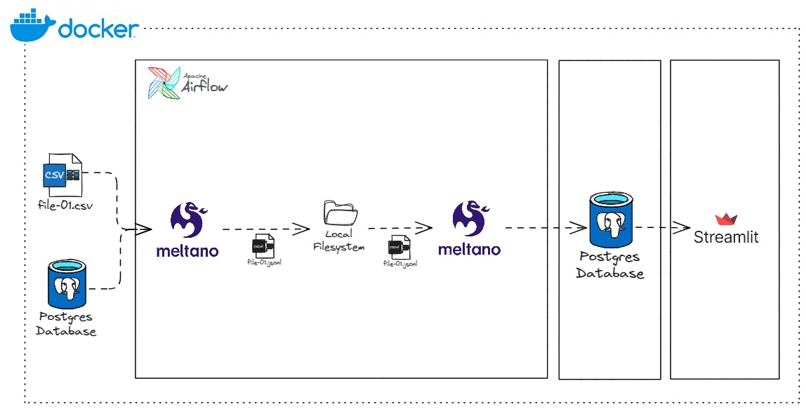
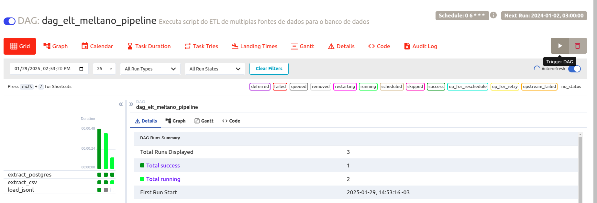
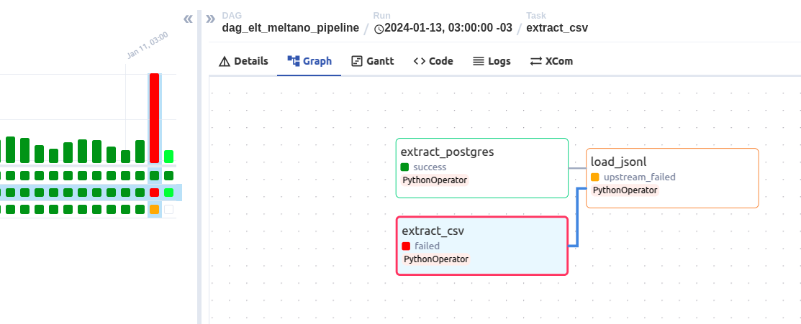

# ELT com Airflow, Meltano, Streamlit e PostgreSQL
<sub>Don't speak Portuguese? [Click here](https://github.com/Robso-creator/elt_meltano_ind/blob/main/README.md) to view
this page in English</sub>

[](https://github.com/pre-commit/pre-commit)

[](https://www.docker.com/)
[](https://www.postgresql.org/)

Este projeto é uma solução para extração, transformação e carregamento de dados (ETL) utilizando Airflow, Meltano, Streamlit e PostgreSQL. Ele permite extrair dados de diferentes fontes, carregá-los em um banco de dados PostgreSQL e visualizar os resultados em um aplicativo Streamlit.

Conta com framework Pre-Commit para gerenciar e manter hooks de pre-commit, garantindo códigos que seguem padrões estabelecidos pela comunidade Python.

---

## Tabela de Conteúdos

- [Pré-requisitos](#pré-requisitos)
- [Arquitetura do Projeto](#arquitetura-do-projeto)
- [Configuração](#configuração)
- [Acesso aos Serviços](#acesso-aos-serviços)
- [Executando Meltano no Terminal](#executando-meltano-no-terminal)
- [Encerrando os Serviços](#encerrando-os-serviços)
- [Solução de Problemas](#solução-de-problemas)
- [Contribuição](#contribuição)

___

## Pré-requisitos

- Docker
- Docker Compose
- Make (opcional, mas recomendado)

## Arquitetura do Projeto



## Configuração

1. **Clone o repositório**:

    ```bash
    git@github.com:Robso-creator/elt_meltano_ind.git
    cd elt_meltano_ind
    ```

2. **Crie o arquivo `.env` na raiz do projeto** com o seguinte conteúdo:

    ```bash
    POSTGRES_USER=postgres
    POSTGRES_PASSWORD=postgres
    ```

3. **Verifique a versão do Docker** para garantir que ele está instalado corretamente:

    ```bash
    docker --version
    ```

4. **Construa a imagem do Streamlit** e inicie os contêineres:

    ```bash
    make build  # Construir a imagem do Streamlit
    make up     # Iniciar os contêineres
    ```

## Acesso aos Serviços

- **Airflow**: Acesse [localhost:8080](http://localhost:8080) para gerenciar e executar os DAGs que extraem dados das fontes e os carregam no banco de dados.
   - Em DAGS, ative o DAG `dag_elt_meltano_pipeline` e espere a execução.
   - Se desejar rodar para uma data específica, aperte o botão de play no canto direito da tela da DAG.
  
   - Depois escolha a data que deseja rodar e aperte ´Trigger´.
  

    - Se a algumas das tarefas de extração falhar, a de carregamento **não executará**.
  

- **Streamlit**: Acesse [localhost:8501](http://localhost:8501) para visualizar o aplicativo Streamlit com os resultados processados.

## Executando Meltano no Terminal

Para executar o Meltano diretamente no terminal, utilize os seguintes comandos:

```bash
make enter-local
SOURCE=postgres YEAR=2025 MONTH=01 DAY=03 meltano run extract-postgres-to-jsonl
SOURCE=csv YEAR=2025 MONTH=01 DAY=03 meltano run extract-csv-to-jsonl
YEAR=2025 MONTH=01 DAY=03 meltano run load-jsonl-to-postgres
```

## Encerrando os Serviços

Para encerrar os contêineres, utilize o comando abaixo:

```bash
make down   # Encerrar os contêineres
make rm     # Remover containers parados e volumes
```

## Solução de Problemas

Caso não consiga acessar a página do Airflow e no `make logs-webserver` encontre o erro `Already running on PID <PID>`, siga os passos abaixo:

1. Pare os contêineres:

    ```bash
    make down
    ```

2. Verifique se há algum processo usando a porta 8080:

    ```bash
    sudo lsof -i tcp:8080
    ```

3. Se houver um processo, mate-o:

    ```bash
    sudo kill -9 PID
    ```

4. Remova o arquivo de PID do Airflow:

    ```bash
    sudo rm -rf meltano/orchestrate/airflow-webserver.pid
    ```

5. Reinicie os contêineres:

    ```bash
    make up
    ```

## Contribuição

Contribuições são bem-vindas! Sinta-se à vontade para abrir issues e pull requests.
