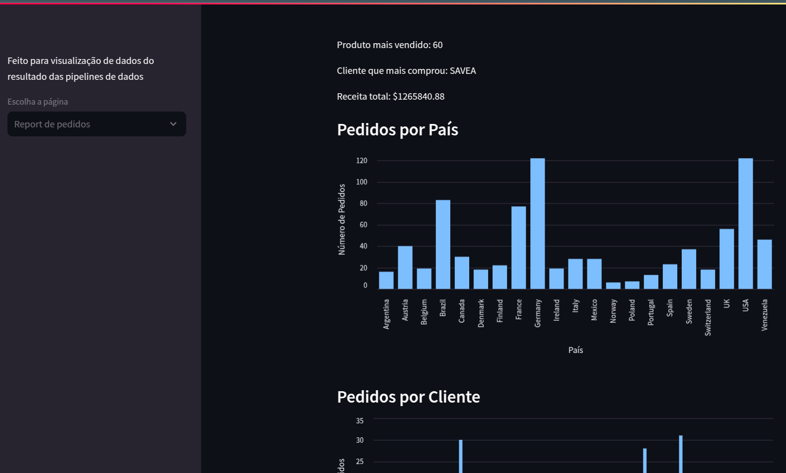

# ELT with Airflow, Meltano, Streamlit, and PostgreSQL
<sub>Não fala Inglês? [Clique aqui](https://github.com/Robso-creator/elt_meltano_ind/blob/main/docs/README-en.md) to view
para ver essa página em Português</sub>

[](https://github.com/pre-commit/pre-commit)

[](https://www.docker.com/)
[](https://www.postgresql.org/)

This project is a solution for data extraction, transformation, and loading (ELT) using Airflow, Meltano, Streamlit, and PostgreSQL. It allows extracting data from different sources, loading it into a PostgreSQL database, and visualizing the results in a Streamlit application.

It includes the Pre-Commit framework to manage and maintain pre-commit hooks, ensuring code that follows standards established by the Python community.

---

## Table of Contents

- [Prerequisites](#prerequisites)
- [Project Architecture](#project-architecture)
- [Setup](#setup)
- [Accessing Services](#accessing-services)
- [Running Meltano in the Terminal](#running-meltano-in-the-terminal)
- [Stopping Services](#stopping-services)
- [Troubleshooting](#troubleshooting)
- [Contribution](#contribution)

___

## Prerequisites

- Docker
- Docker Compose
- Make (optional but recommended)

## Project Architecture


### Why was JSONL chosen?

**JSONL (JSON Lines)** was selected as the data storage format for this project because it is more flexible and works well in modern pipelines. Here are the main reasons:

1. **Simple Structure**: It allows storing complex and nested data, such as lists and objects, without "flattening" the data.
2. **Stream Processing**: Each line is an independent JSON object, making it suitable for processing large datasets without loading everything into memory.
3. **Compatibility**: It is widely supported by modern ETL tools and APIs, making integration easier.
4. **Easy Debugging**: An error in one line does not affect the entire file, making it easier to identify and fix issues.

## Setup

1. **Clone the repository**:

    ```bash
    git@github.com:Robso-creator/elt_meltano_ind.git
    cd elt_meltano_ind
    ```

2. **Create the `.env` file** in the project root with the following content:

    ```bash
    POSTGRES_USER=postgres
    POSTGRES_PASSWORD=postgres
    ```

3. **Check the Docker version** to ensure it is installed correctly:

    ```bash
    docker --version
    ```

4. **Build the Streamlit image** and start the containers:

    ```bash
    make build  # Build the Streamlit image
    make up     # Start the containers
    ```

## Accessing Services

- **Airflow**: Access [localhost:8080](http://localhost:8080) to manage and execute the DAGs that extract data from sources and load it into the database.
   - In DAGS, enable the `dag_elt_meltano_pipeline` DAG and wait for execution.
   - If you want to run it for a specific date, click the play button on the right side of the DAG screen.
  
   - Then choose the date you want to run and click ´Trigger´.
  

    - If any of the extraction tasks fail, the loading task **will not execute**.
  

- **Streamlit**: Access [localhost:8501](http://localhost:8501) to view the Streamlit application with the processed results.


## Running Meltano in the Terminal

To run Meltano directly in the terminal, use the following commands:

```bash
make enter-local
SOURCE=postgres YEAR=2025 MONTH=01 DAY=03 meltano run extract-postgres-to-jsonl
SOURCE=csv YEAR=2025 MONTH=01 DAY=03 meltano run extract-csv-to-jsonl
YEAR=2025 MONTH=01 DAY=03 meltano run load-jsonl-to-postgres
```

## Stopping Services

To stop the containers, use the following command:

```bash
make down   # Stop the containers
make rm     # Remove stopped containers and volumes
```

## Troubleshooting

If you cannot access the Airflow page and find the error `Already running on PID <PID>` in `make logs-webserver`, follow the steps below:

1. Stop the containers:

    ```bash
    make down
    ```

2. Check if any process is using port 8080:

    ```bash
    sudo lsof -i tcp:8080
    ```

3. If there is a process, kill it:

    ```bash
    sudo kill -9 PID
    ```

4. Remove the Airflow PID file:

    ```bash
    sudo rm -rf meltano/orchestrate/airflow-webserver.pid
    ```

5. Restart the containers:

    ```bash
    make up
    ```

## Contribution

Contributions are welcome! Feel free to open issues and pull requests.
